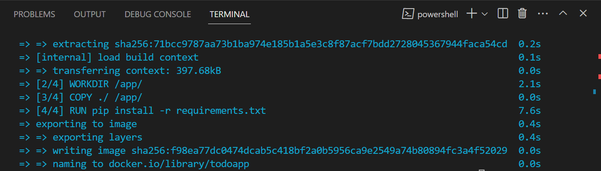
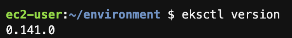
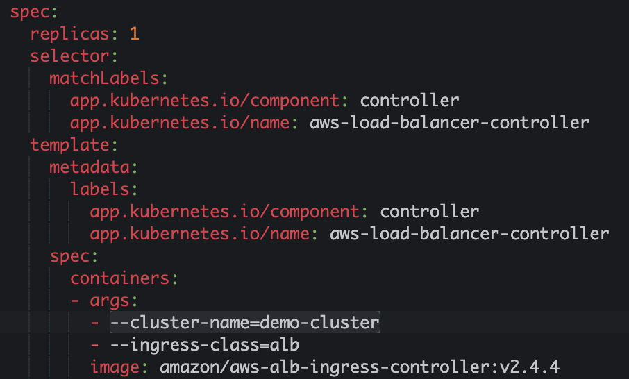
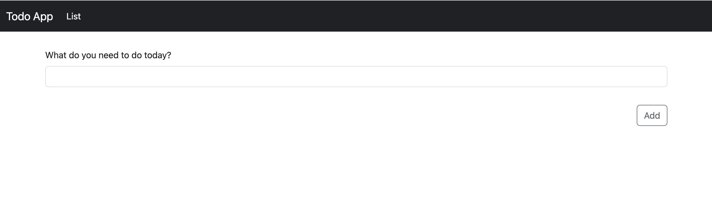
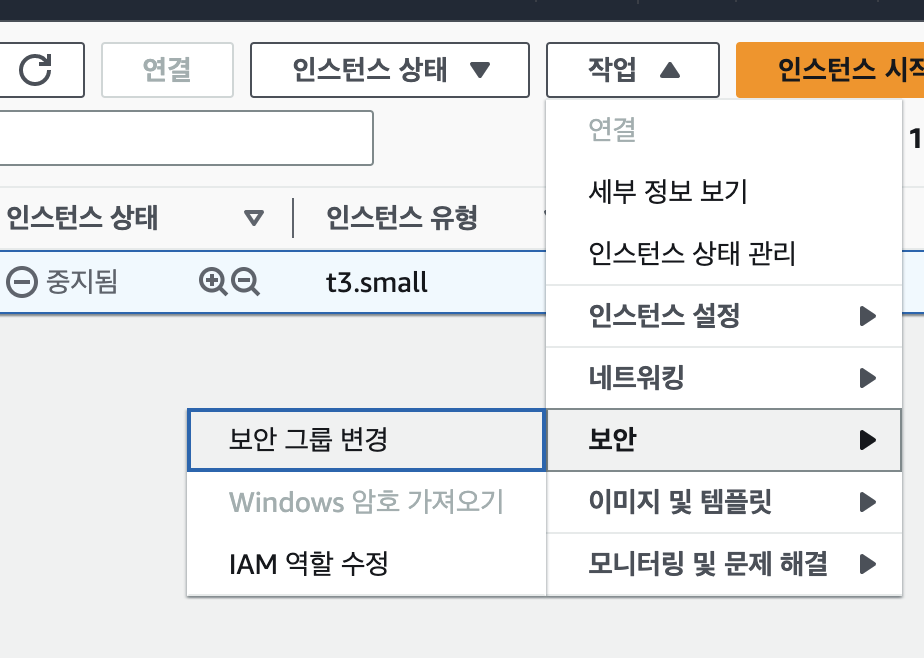
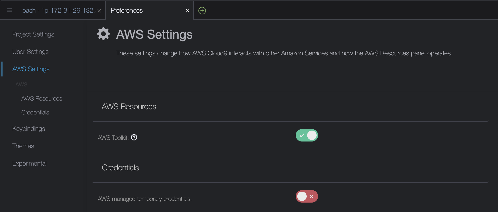

# Lab3:  EKS에 웹 애플리케이션 배포하기

## 사전 준비 사항

- Docker 설치
    - [https://docs.docker.com/engine/install/](https://docs.docker.com/engine/install/)
- Cloud9에 Kubectl 설치
    - [https://docs.aws.amazon.com/ko_kr/eks/latest/userguide/install-kubectl.html](https://docs.aws.amazon.com/ko_kr/eks/latest/userguide/install-kubectl.html)
    - Cloud9 IDE EKS 권한 설정 (하단 첨부)

### 실습 내용

- Docker 이미지 만들기
- Docker 이미지 업로드
    - ECR 생성
- EKS 클러스터에 샘플 애플리케이션 배포하기
    - EKS 클러스터 생성
    - EKS 클러스터 연결
    - 배포 생성
    - 서비스 생성
    - 인그레스 컨트롤러 생성
    - 매니페스트 배포
- 배포 테스트

## 실습 내용

### Docker 이미지 만들기

Lab1에서 다운로드 받은 프로젝트를 기반으로 진행합니다.

1. 프로젝트 루트에서 `app` 폴더를 생성하고 [`main.py`](http://main.py) 파일을 `app/main.py`로 이동합니다.
2. 프로젝트 루트에 아래와 같이 `Dockerfile`을 생성합니다.
    
    ```docker
    FROM python:3.9
    
    WORKDIR /code
    
    COPY ./static /code/static
    COPY ./requirements.txt /code/requirements.txt
    
    RUN pip install --no-cache-dir --upgrade -r /code/requirements.txt
    COPY ./app /code/app
    
    EXPOSE 8000
    
    CMD ["uvicorn", "app.main:app", "--host", "0.0.0.0", "--port", "8000"]
    ```
    

1. 터미널을 실행하여 프로젝트 루트 경로로 이동합니다. 루트에서 아래 명령어를 실행하여 이미지를 빌드합니다.
    
    ```bash
    docker build -t todoapp .
    ```
    
    
    
2. 아래 명령어를 사용하여 컨테이너를 실행시키고, `localhost:8000`에 접속하여 정상 동작을 확인합니다.
    
    ```bash
    docker run -dp 8000:8000 todoapp
    ```
    

### Docker 이미지 업로드

**ECR 생성**

1. AWS 콘솔([https://aws.amazon.com/ko/console/](https://aws.amazon.com/ko/console/))에 접속합니다.
2. 왼쪽 상단 검색창에서 `ECR`을 입력하여 `프라이빗 레지스트리` 화면으로 이동합니다.
3. 왼쪽 메뉴에서 `Repositories`를 클릭하고 `리포지토리 생성` 버튼을 클릭합니다.
4. 아래와 같이 구성 후 `리포지토리 생성` 버튼을 클릭합니다.
    - 표시 여부 설정 : 프라이빗
    - 리포지토리 이름 : todo-app
5. 생성된 `todo-app` 리포지토리 이름을 클릭합니다.
6. 오른쪽 상단 `푸시 명령 보기`를 클릭 후, 명령어를 차례로 실행하여 이미지를 업로드 합니다.

### EKS 클러스터에 샘플 애플리케이션 배포하기

**EKS 클러스터 생성**

1. Lab1에서 생성한 Cloud9 IDE로 이동합니다.

EKS 클러스터를 생성하기 위해 `eksctl`을 설치합니다. `eksctl` 은 Amazon EKS에서 Kubernetes 클러스터를 생성하고 관리하기 위한 간단한 명령줄 도구입니다. `eksctl`Amazon EKS용 노드로 새 클러스터를 생성하는 가장 빠르고 쉬운 방법을 제공합니다.

1. Cloud9 IDE에서 + 버튼을 클릭하고  New Terminal을 선택합니다.
2. 아래 명령어를 통해 `eksctl`을 설치합니다.
    
    ```bash
    # for ARM systems, set ARCH to: `arm64`, `armv6` or `armv7`
    ARCH=amd64
    PLATFORM=$(uname -s)_$ARCH
    
    curl -sLO "https://github.com/weaveworks/eksctl/releases/latest/download/eksctl_$PLATFORM.tar.gz"
    
    # (Optional) Verify checksum
    curl -sL "https://github.com/weaveworks/eksctl/releases/latest/download/eksctl_checksums.txt" | grep $PLATFORM | sha256sum --check
    
    tar -xzf eksctl_$PLATFORM.tar.gz -C /tmp && rm eksctl_$PLATFORM.tar.gz
    
    sudo mv /tmp/eksctl /usr/local/bin
    ```
    
3. 아래 명령어를 통해 정상 설치를 확인합니다.
    
    ```bash
    eksctl version
    ```
    
    
    
4. 아래 명령어를 사용하여 EKS를 생성합니다.
    - *`region-code`*를 클러스터를 생성할 AWS 리전으로 바꿉니다.
    - *`my-cluster`*를 클러스터 이름으로 바꿉니다. 이름에는 영숫자(대소문자 구분)와 하이픈만 사용할 수 있습니다. 영문자로 시작해야 하며 100자 이하여야 합니다. 이름은 클러스터를 생성하는 AWS 리전과 AWS 계정 내에서 고유해야 합니다.
    - *`1.25`*를 모든 [Amazon EKS 지원 버전](https://docs.aws.amazon.com/ko_kr/eks/latest/userguide/kubernetes-versions.html)으로 변경합니다.
    
    ```bash
    eksctl create cluster --name my-cluster --region region-code --version 1.25
    ```
    

**EKS 클러스터 연결**

1. Cloud9에서 아래 명령어를 사용하여 생성한 클러스터를 연결합니다.
    
    ```json
    aws eks update-kubeconfig --name my-cluster --region region-code
    ```
    

**배포 생성**

1. `ECR 대시보드`로 이동하여 `todo-app` 리포지토리의 URI를 복사합니다.
2. 아래 명령어를 수행하여 `deploy manifest`를 생성합니다.
    - `containers image` 항목에 복사해둔 `todo-app` 리포지토리 `URI`를 붙여넣습니다.
    
    ```yaml
    cat <<EOF> fastapi-deployment.yaml
    ---
    apiVersion: apps/v1
    kind: Deployment
    metadata:
      name: demo-fastapi-app
      namespace: default
    spec:
      replicas: 1
      selector:
        matchLabels:
          app: demo-fastapi-app
      template:
        metadata:
          labels:
            app: demo-fastapi-app
        spec:
          containers:
            - name: todo-app
              image: <image-uri>
              imagePullPolicy: Always
              ports:
                - containerPort: 8000
    EOF
    ```
    

**서비스 생성**

1. 아래 명령어를 수행하여 `service manifest` 파일을 생성합니다.
    
    ```yaml
    cat <<EOF> fastapi-service.yaml
    ---
    apiVersion: v1
    kind: Service
    metadata:
      name: demo-fastapi-app
    spec:
      selector:
        app: demo-fastapi-app
      type: NodePort
      ports:
        - port: 80 # 서비스가 생성할 포트  
          targetPort: 8000 # 서비스가 접근할 pod의 포트
          protocol: TCP
    EOF
    ```
    

**인그레스 컨트롤러 생성**

[Amazon EKS의 Application Load Balancing](https://docs.aws.amazon.com/eks/latest/userguide/alb-ingress.html) 이란 클러스터에 인그레스 자원이 생성될 때에 ALB(Application Load Balancer) 및 필요한 자원이 생성되도록 트리거하는 컨트롤러입니다. 인그레스 자원들은 ALB를 구성하여 HTTP 또는 HTTPS 트래픽을 클러스터 내 파드로 라우팅합니다.

1. 매니페스트를 관리하기 위해 루트 폴더(예: /home/ec2-user/environment/)에서 `manifests`라는 이름을 가진 폴더를 생성합니다. 그 후, manifests 폴더 안에서, ALB 인그레스 컨트롤러 관련 매니페스트를 관리하기 위한 폴더 `alb-ingress-controller`를 만듭니다.
    
    ```bash
    cd ~/environment
    
    mkdir -p manifests/alb-ingress-controller && cd manifests/alb-ingress-controller
    ```
    

AWS Load Balancer 컨트롤러를 배포하기 전, 우리는 몇 가지 작업을 수행해야 합니다. controller가 워커 노드 위에서 동작되기 때문에 IAM permissions를 통해, AWS ALB/NLB 리소스에 접근할 수 있도록 만들어야 합니다.

2. AWS Load Balancer 컨트롤러를 배포하기 전, 클러스터에 대한 `IAM OIDC(OpenID Connect) identity Provider`를 생성합니다. 쿠버네티스가 직접 관리하는 사용자 계정을 의미하는 `service account`에 IAM role을 사용하기 위해, 생성한 클러스터에 `IAM OIDC provider`가 존재해야 합니다.
    
    ```bash
    eksctl utils associate-iam-oidc-provider \
        --region ${AWS_REGION} \
        --cluster demo-cluster \
        --approve
    ```
    
3. `AWS Load Balancer Controller`에 부여할 `IAM Policy`를 생성하는 작업을 수행합니다.
    
    ```bash
    curl -o iam-policy.json https://raw.githubusercontent.com/kubernetes-sigs/aws-load-balancer-controller/v2.4.4/docs/install/iam_policy.json
    ```
    
    ```bash
    aws iam create-policy \
        --policy-name AWSLoadBalancerControllerIAMPolicy \
        --policy-document file://iam-policy.json
    ```
    
4. `AWS Load Balancer Controller`를 위한 `ServiceAccount`를 생성합니다.
    
    ```bash
    eksctl create iamserviceaccount \
        --cluster eks-demo \
        --namespace kube-system \
        --name aws-load-balancer-controller \
        --attach-policy-arn arn:aws:iam::$ACCOUNT_ID:policy/AWSLoadBalancerControllerIAMPolicy \
        --override-existing-serviceaccounts \
        --approve
    ```
    
5. AWS Load Balancer controller를 클러스터에 추가하는 작업을 수행합니다.
    
    ```bash
    kubectl apply --validate=false -f https://github.com/jetstack/cert-manager/releases/download/v1.5.4/cert-manager.yaml
    wget https://github.com/kubernetes-sigs/aws-load-balancer-controller/releases/download/v2.4.4/v2_4_4_full.yaml
    ```
    
6. yaml 파일에서 클러스터의 `cluster-name`을 편집합니다.
    
    
    
7. 그리고 yaml 파일에서 ServiceAccount yaml spec을 없애줍니다. AWS Load Balancer Controller를 위한 ServiceAccount를 이미 생성했기 때문입니다. 아래의 내용을 삭제한 후, yaml 파일을 저장합니다.
    
    ```bash
    ---
    apiVersion: v1
    kind: ServiceAccount
    metadata:
      labels:
        app.kubernetes.io/component: controller
        app.kubernetes.io/name: aws-load-balancer-controller
      name: aws-load-balancer-controller
      namespace: kube-system
    ```
    
8. `AWS Load Balancer controller` 파일을 배포합니다.
    
    ```bash
    kubectl apply -f v2_4_4_full.yaml
    ```
    
9. 아래 명령어를 수행하여 `ingress manifest` 파일을 생성합니다.
    
    ```yaml
    cat <<EOF> todo-ingress.yaml
    ---
    apiVersion: networking.k8s.io/v1
    kind: Ingress
    metadata:
      name: "todo-ingress"
      namespace: default
      annotations:
        kubernetes.io/ingress.class: alb
        alb.ingress.kubernetes.io/scheme: internet-facing
        alb.ingress.kubernetes.io/target-type: ip
        alb.ingress.kubernetes.io/group.name: demo-group
        alb.ingress.kubernetes.io/group.order: '3'
    spec:
      rules:
        - http:
            paths:
              - path: /
                pathType: Prefix
                backend:
                  service:
                    name: "demo-fastapi-app"
                    port:
                      number: 80
    EOF
    ```
    

**매니페스트 배포**

1. 위에서 생성한 매니페스트를 아래의 순서대로 배포합니다.
    
    ```bash
    kubectl apply -f fastapi-deployment.yaml
    kubectl apply -f fastapi-service.yaml
    kubectl apply -f todo-ingress.yaml
    ```
    

### 배포 테스트

아래 명령어를 입력하여 출력된 URL을 복사하여 새 탭을 열고 접속해 줍니다.

```bash
echo http://$(kubectl get ingress/todo-ingress -o jsonpath='{.status.loadBalancer.ingress[*].hostname}')
```



**(부록)**

**Cloud9 IDE EKS 권한 설정** 

1. 왼쪽 상단 검색창에서 `EC2` 입력하여 `EC2 대시보드`로 이동합니다.
2. `aws-cloud9-` 으로 시작하는 인스턴스를 찾아서 선택합니다.
3. 오른쪽 상단 `작업` 버튼 클릭 후, `보안 > IAM 역할 수정` 메뉴를 클릭합니다.
    
    
    
4. 연결된 IAM 역할을 기억하고 `IAM 대시보드`로 이동하여 해당 역할을 클릭합니다.
5. `권한 정책`에서 `권한 추가`를 클릭하고 `정책 연결`을 클릭합니다.
6. `정책 생성`을 클릭하고 `정책 편집기 유형`을 `JSON`으로 변경한 뒤, 아래의 내용을 붙여넣어 줍니다.
    
    ```json
    {
        "Version": "2012-10-17",
        "Statement": [
            {
                "Sid": "VisualEditor5",
                "Effect": "Allow",
                "Action": "eks:*",
                "Resource": [
                    "arn:aws:eks:*:*:cluster/*",
                    "arn:aws:eks:*:*:nodegroup/*/*/*"
                ]
            }
        ]
    }
    ```
    
7. `다음` 버튼을 클릭하고, 정책 이름에 `Cloud9RoleForEKS`을 입력한 뒤 `정책 생성` 버튼을 클릭합니다.
8. 다시 권한 추가 페이지로 돌아와서 생성한 `Cloud9RoleForEKS`를 선택하고 `권한 추가` 버튼을 클릭합니다.
9. `Cloud9 IDE`로 이동하여 오른쪽 상단 `톱니 바퀴 모양` 버튼을 클릭합니다.
10. 왼쪽 메뉴에서 AWS Settings를 클릭하고 Credentias에서 아래 옵션을 끕니다.
    
    