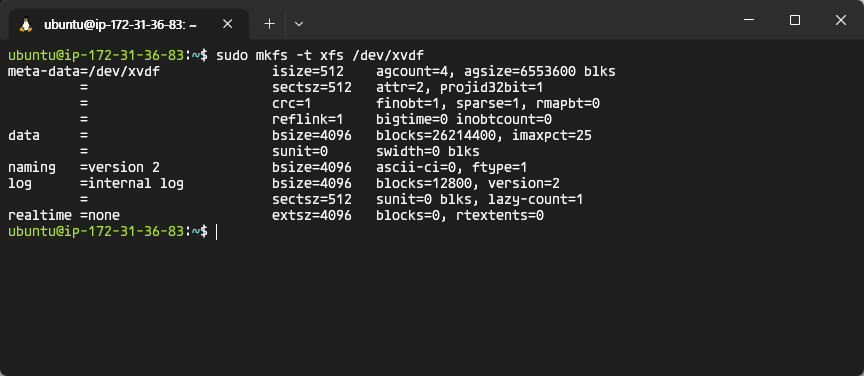

# 가상머신에 데이터 디스크 추가하기

### 사전 준비 사항

- AWS 계정

## 실습 내용

- AWS EC2 배포하기
- 데이터 디스크용 EBS 볼륨 추가하기
- 성능 테스트

###  AWS EC2 배포하기

1. AWS 콘솔(https://aws.amazon.com/console)에 접속하여 로그인 합니다.
2. 왼쪽 상단 검색창에서 EC2를 입력하여 EC2 서비스 화면으로 이동합니다.
   
3.  왼쪽 패널에서 인스턴스를 선택합니다.
   

4. 인스턴스 시작 버튼을 선택합니다.
   

5. EC2인스턴스 이름을 기입하고, 아래 정보 대로 인스턴스를 생성합니다.

   
   AMI 이름 : `Ubuntu Server 22.04 LTS(HVM)`
   아키텍처 : `64비트(x86)`
   인스턴스 유형 : `t2.micro` (*프리티어 사용 가능)
   키페어 : `새 키페어 생성` - `키페어 이름 입력 후 생성` (키페어 파일 자동 다운로드)
   네트워크 설정 : `내IP에서 SSH트래픽 허용`
   스토리지 구성 : `8GiB gp2`
   

   6. 생성된 EC2인스턴스를 선택하여 세부 정보 탭에서 퍼블릭 IPv4 주소를 복사합니다.
      

   7. 터미널 창을 열어서 키페어 파일을 다운로드 받은 위치에서 SSH 명령어를 실행합니다.
      `ssh -i ./키페어파일이름.pem ubuntu@EC2공인IP`

      

      *Permission denied 오류가 난다면 아래 명령어를 실행한 다음 다시 SSH 접속을 시도합니다.
      `chmod 400 키페어파일.pem`

   8. `df -h`명령어를 실행하면 루트 볼륨 8GB 하나를 쓰고 있음을 확인할 수 있습니다.

      

   

   ### 데이터 용 EBS 볼륨 추가하기

   1. AWS 콘솔로 돌아가서 왼쪽 패널에서 볼륨을 선택합니다.
      

   2. 볼륨 생성 버튼을 선택합니다.
      

   3. 크기는 100GB로 설정하고, 가용영역을 EC2와 동일하게 선택한 뒤 볼륨을 생성합니다.
      

      *EC2 세부 정보 탭에서 서브넷을 선택하면 가용 영역 정보를 확인할 수 있습니다.

   4. 생성한 볼륨을 선택한 다음 작업 버튼을 선택하여 볼륨 연결을 선택합니다.
      

   5. 생성한 EC2를 지한 뒤 볼륨 연결을 선택합니다.
      

   6. 터미널 창으로 돌아와 `lsblk`명령어를 실행하면 100G disk가 추가된 것을 확인할 수 있습니다.

      

   7. 비어있는 볼륨이므로 파일시스템을 지정해줍니다.
      `sudo mkfs -t xfs /dev/xvdf`

      

   8. 디스크를 마운트 하기위한 디렉토리를 생성합니다.
      `sudo mkdir /data`

      

   9. 마운트를 한 뒤 df -h로 디스크 정보를 확인하면 100G 볼륨이 마운트 된것을 확인할 수 있습니다.
      `sudo mount /dev/xvdf /data`

      

   ### 디스크 성능 테스트

   1. 아래 명령어로 패키지 업데이트를 해줍니다.
      `sudo apt-get update`

   2. 새로 생성한 /data 경로로 이동하여 dd명령어를 이용하여 쓰기 성능을 측정합니다.
      `sudo dd if=/dev/zero bs=1024 count=100 of=test oflag=direct`

      

   3. 아래 명령어를 이용해 디스크 접근 속도를 측정합니다.
      `sudo hdparm -Tt /dev/xvdf`

      

### (Optional) EC2 인스턴스 타입 업그레이드 후 다시 측정

아래 단계는 비용이 청구될 수 있으므로 인스턴스 유형에 따른 성능 차이를 테스트 해보고자 하는 경우에만 진행합니다.

1. 인스턴스 유형을 변경하기 위하여, 대상 인스턴스를 선택한 뒤 상태를 중지로 바꿉니다.
   

2. 중지가 완료되면, 작업 - 인스턴스 설정 - 인스턴스 유형 변경을 선택합니다.
   

3. 인스턴스 유형을 `m6i.large` 로 변경해줍니다.
   

4. 인스턴스를 다시 시작해줍니다.

   * Elastic IP 를 연결한 게 아니라면, EC2인스턴스를 중지하고 시작할 때 마다 새로운 Public IP를 할당받게 됩니다. SSH 접속시 유의

   

5. 터미널에서 SSH로 인스턴스에 접속한 뒤, 디스크 볼륨 마운트 과정을 반복해줍니다.
   *재부팅 후에도 연결된 볼륨을 자동으로 마운트 해주려면?
   `sudo blkid` 로 새 EBS볼륨의 UUID를 확인한 다음, `sudo vi /etc/fstab`에서 아래 내용(마지막줄)을 추가 해줍니다.
   

6. 성능 측정을 다시 하여 인스턴스 유형에 따라 어떻게 달라지는지 비교해봅니다.

   