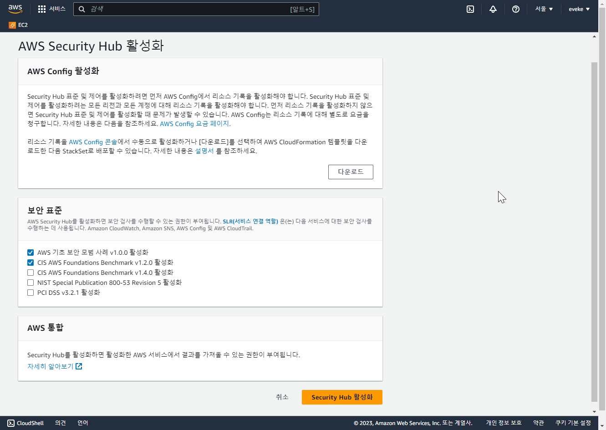

# AWS 보안 서비스 알아보기

**사전 준비 사항**

- AWS 계정

## 실습 내용

- AWS 보안 서비스들 살펴보고 어떤 정보를 얻는지 알아보기

### 1. AWS Security Hub

AWS 콘솔 상단 검색창에서 Security Hub를 검색합니다.

활성화를 할 경우, 30일간 평가판으로 무료로 사용이 가능하며, 그 이후부터는 사용량에 따라 요금이 과금 됩니다. 서비스를 활성화 하면 Inspector, Macie, Guardduty의 결과들을 수집하여 하나의 대시보드에서 확인할 수 있도록 합니다.

활성화를 할 때, 업계 표준 또는 모범 사례를 선택하여 AWS서비스에 대한 보안 검사를 할 때 적용할 정책을 설정합니다.

서비스가 활성화가 되고 보안 검사 결과가 나오기 까지 최대 2시간까지 소요될 수 있습니다.

디폴트로 설정한 AWS 기초 보안 모범 사례 v1.0.0을 선택하면 중요도 별로 미리 만들어져 있는 보안 정책들이 있음을 확인할 수 있습니다.

중요도가 높은 정책들은 반드시 준수를 할 수 있도록 설정하는 것이 중요합니다. 이 중에서 루트 사용자에 대한 정책을 살펴 보겠습니다.

이 정책의 경우 AWS 계정의 루트 사용자의 경우 반드시 물리적인 2차 인증 MFA를 설정하도록 하는 정책입니다. AWS 계정에 대한 가장 높은 권한을 가진 루트 계정이 탈취 될 경우, 예상치 못한 피해를 입을 수 있으니 반드시 해당 정책을 준수 하도록 합니다.

하나 이상의 리전(지역)을 사용하는 경우, 단일로 집계 하여 관리할 수 있습니다. 

아래 목록과 같이 리전을 선택할 수 있으며, Security Hub 대시보드에서 통합하여 정보를 확인할 수 있습니다.

### 2. AWS Config

AWS 콘솔 상단 검색창에서 Config를 검색하여 서비스 화면으로 이동합니다.

서비스가 비활성 되어있는 것을 활성화 시킵니다. [편집]>>[기록 활성화]

기록을 활성화 할 때 데이터 수집 유형, 보존 기간 등을 선택할 수 있습니다.

데이터를 저장할 S3 버킷을 선택할 수 있습니다.

왼쪽 패널에서 규정 준수 팩을 선택하여 배포를 선택합니다.

이미 생성이 되어있는 규정 준수 팩을 살펴 보면, 특정 거버넌스 또는 규정 준수 표준을 제공하는 것을 알 수 있습니다. 

이 중 CIS AWS v1.4 Level2를 선택합니다.

규칙에서 목록을 확인할 수 있습니다.

대시보드에서 AWS 리소스의 규칙 준수 여부를 확인할 수 있습니다.

또한 사용량 지표에서 AWS Config가 규정 준수 점검을 할 때 발생하는 이벤트에 대하여 확인할 수 있습니다.

### 3. AWS Certificate Manager(ACM)

AWS 콘솔 상단 검색창에서 Certificate Manager를 검색합니다.

ACM은 인증서를 발급, Import, 관리할 수 있는 관리형 서비스 입니다. 인증서 요청을 선택합니다.

발급 받을 수 있는 인증서의 유형으로는 Public과 Private이 있습니다.

미리 구매해 둔 사용자 도메인(ex.test.com)을 입력하고 해당 도메인을 인증받기 위한 방법을 선택합니다. (DNS 레코드 검증, 이메일 검증)
그리고 키 알고리즘을 선택하여 인증서를 생성하면 AWS ELB, CloudFront등에서 SSL termination 처리를 할 때 사용할 수 있습니다.

### 4. Amazon Guard Duty

AWS 콘솔 상단 검색창에서 GuardDuty를 검색 합니다.

Guard Duty 서비스를 활성화 하면, 3가지 로그를 수집하여 분석을 시작합니다. 3가지 로그는 AWS CloudTrail 로그, VPC Flow 로그, DNS로그 입니다. 이외의 AWS서비스 로그도 Guard Duty를 통해 분석할 수 있습니다.
수집된 해당 로그들은 머신러닝 기반의 탐지를 통해서 보안 위험 사항을 찾아 내어 사용자에게 알려줍니다.

### 5. Amazon Inspector

AWS 콘솔 상단 검색창에서 Inspector를 검색하여 이동합니다.

Inspector를 활성화 하면, AWS에 있는 리소스(EC2, ECR, Lambda)를 대상으로 소프트웨어 취약성과 네트워크 구성에 대한 점검을 진행합니다.
EC2를 스캐닝 하려는 경우, SSM 에이전트가 설치되어있고 활성화 되어있어야 하므로 EC2배포 시 유의 하여야 합니다.

### 6. KMS

AWS 콘솔 상단 검색창에서 KMS를 검색하여 이동합니다.

KMS는 키를 생성, 보관하는 관리형 서비스 입니다. 

기존에 있는 키를 Import하거나, 아래와 같이 AWS내에서 키를 새로 생성할 수 있습니다. KMS에 저장한 키는 대부분 AWS 리소스의 저장된 데이터를 암복호화할 때 사용 됩니다.

### 7. WAF

AWS콘솔 상단에서 WAF를 검색해서 이동합니다. WAF는 L7단 공격으로부터 AWS 리소스를 보호할 수 있습니다. WAF를 배치할 수 있는 AWS서비스에는 ALB, CloudFront, API Gateway 등이 있습니다.

AWS WAF사용을 위해서는 먼저 웹ACL을 생성해야 합니다.

규칙 추가에서 [Add managed rule groups]를 선택하면 이미 만들어져 있는 규칙 모음을 확인할 수 있습니다. (자체적으로 생성도 가능)

OWASP Top 10기반으로 만들어진 AWS managed rule groups 부터, 다양한 제조사에서 생성한 규칙 그룹을 이용할 수 있습니다. 각 규칙그룹은 제조사가 관리하고 업데이트 합니다.

AWS WAF에는 웹ACL 용량 단위(WCU)가 있습니다. 제공되어있는 규칙들을 모두 사용할 수는 없으며, 최대 용량(5,000WCU)에 맞춰서 추가 할 수 있으니 유의 하셔야 합니다.

생성된 웹ACL의 로그&모니터링 설정을 활성화 할 수 있습니다.

로그 모니터링을 활성화 하여 웹ACL에서 분석한 트래픽에 대한 정보를 확인 할 수 있습니다. (수신 시간, 요청에 대한 정보, 규칙 정보 등)

### 8. AWS Shield

AWS Shield는 Standard와 Advanced로 나뉘는 DDos 공격 완화 서비스 입니다. 
왼쪽 패널에서 AWS Shield를 선택하면 Advanced 를 활성화하는 버튼이 있습니다. 이는 월에 3000$를 납부 해야 하는 서비스 이므로 필요시에만 활성화 하시는 것을 권장 드립니다.

Shield Standard는 따로 활성화를 하지 않아도 추가 비용 없이 AWS를 사용하면 자동으로 제공되는 기능입니다. AWS네트워크로 들어오는 L3,4단의 공격으로부터 보호를 받습니다. 하지만 그에 관한 모니터링을 제공하지 않으며 리포트 또한 확인할 수 없습니다.

Shield Advanced의 경우 Standard보다 높은 수준의 보호 기능을 제공합니다. 또한 SRT라는 전담 대응팀의 지원을 받는 등 고급 기능들을 제공합니다.

