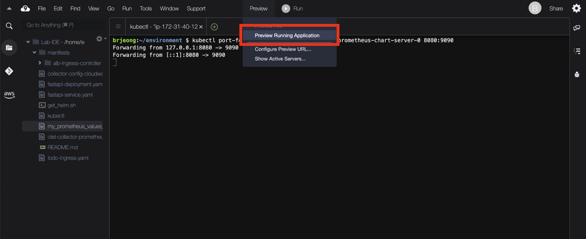
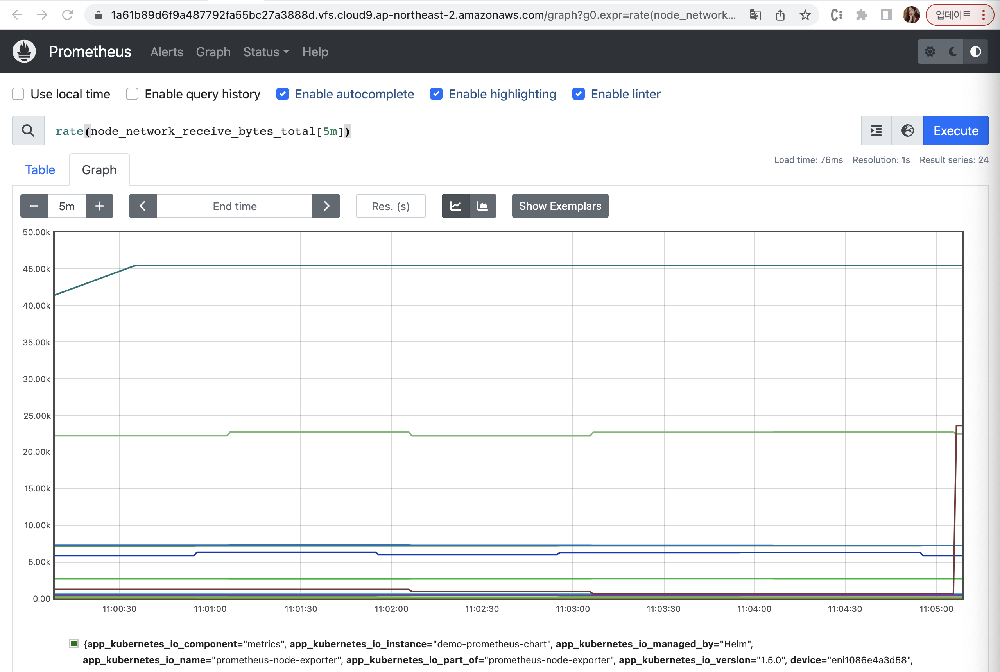

# Lab7: Amazon Prometheus를 사용하여 Amazon EKS 메트릭 수집

## 워크스페이스 생성

1. [Amazon Prometheus](https://console.aws.amazon.com/prometheus/) 로 이동합니다.
2. 새 AMP 워크스페이스의 별칭으로 `observability-demo`을 입력하고`Create`를 클릭합니다.

## Amazon EKS에서 메트릭 수집

Amazon Managed Service for Prometheus는 Kubernetes 또는 ECS 클러스터의 컨테이너화된 워크로드에서 운영 지표를 직접 스크랩하지 않습니다. 이 작업을 수행하려면 사용자가 표준 Prometheus 서버, Grafana 클라우드 에이전트 또는 OpenTelemetry 수집기용 AWS Distro와 같은 OpenTelemetry 에이전트를 클러스터에 배포하고 관리해야 합니다.

### Helm 설치

터미널에서 다음 명령을 실행합니다.

```bash
curl -fsSL -o get_helm.sh https://raw.githubusercontent.com/helm/helm/master/scripts/get-helm-3
chmod 700 get_helm.sh
./get_helm.sh
```

### Amazon EBS CSI 드라이버 설치

Amazon EBS를 기반으로 영구 볼륨 및 영구 볼륨 클레임을 사용하려면 Prometheus 서버 포드를 활성화 해야 합니다.

1. Amazon EBS CSI 드라이버를 사용하는 데 필요한 정책으로 iam 서비스 계정 "ebs-csi-controller-sa"를 생성합니다.
    
    ```bash
    eksctl create iamserviceaccount   \
    --name ebs-csi-controller-sa   \
    --namespace kube-system   \
    --cluster <cluster-name>   \
    --attach-policy-arn arn:aws:iam::aws:policy/service-role/AmazonEBSCSIDriverPolicy  \
    --approve \
    --role-only \
    --role-name AmazonEKS_EBS_CSI_DriverRole
    ```
    

2. 아래 명령어를 사용하여 `AmazonEKS_EBS_CSI_DriverRole` 역할의 ARN 가져옵니다.
    
    ```bash
    export SERVICE_ACCOUNT_ROLE_ARN=$(aws iam get-role --role-name AmazonEKS_EBS_CSI_DriverRole | jq -r '.Role.Arn')
    ```
    

3. 아래 명령을 사용하여 `AmazonEKS_EBS_CSI_DriverRole`을 사용하여 EKS용 Amazon EBS CSI 추가 기능을 설치합니다.
    
    ```bash
    eksctl create addon --name aws-ebs-csi-driver --cluster <cluster-name> --service-account-role-arn $SERVICE_ACCOUNT_ROLE_ARN --force
    ```
    
4. 아래 명령을 사용하여 드라이버 추가 기능이 작동하는지 확인합니다.
    
    ```bash
    kubectl get pods -n kube-system | grep ebs
    ```
    

### 새 Helm 차트 리포지토리 추가

1. 터미널에서 아래 명령을 실행합니다.
    
    ```bash
    helm repo add prometheus-community https://prometheus-community.github.io/helm-charts
    helm repo add kube-state-metrics https://kubernetes.github.io/kube-state-metrics
    helm repo update
    ```
    

2. Prometheus 네임스페이스를 생성합니다.
    
    ```bash
    kubectl create namespace prometheus
    ```
    

### **IRSA (서비스 계정)에 대한 IAM 역할 설정**

AWS Cloudformation을 사용하여 `prometheus`라는 네임스페이스를 만들고, `amp-iamproxy-ingest-role`라는 서비스 계정을 만들고, `AmazonPrometheusRemoteWriteAccess` 정책이 연결된 새 IAM 역할을 생성합니다.

```bash
eksctl create iamserviceaccount \
--name amp-iamproxy-ingest-role \
--namespace prometheus \
--cluster <cluster-name> \
--attach-policy-arn arn:aws:iam::aws:policy/AmazonPrometheusRemoteWriteAccess \
--approve \
--override-existing-serviceaccounts
```

### **Prometheus 서버 설정 및 지표 수집 시작**

1. 아래 스크립트를 사용해 클러스터에 `Prometheus 서버`를 구성하고 설치합니다.
    
    ```bash
    WORKSPACE_ID=$(aws amp list-workspaces --alias observability-workshop | jq .workspaces[0].workspaceId -r)
    helm install amp-prometheus-chart prometheus-community/prometheus -n prometheus -f https://raw.githubusercontent.com/aws-samples/one-observability-demo/main/PetAdoptions/cdk/pet_stack/resources/amp_ingest_override_values.yaml \
    --set server.remoteWrite[0].url="https://aps-workspaces.${AWS_REGION}.amazonaws.com/workspaces/${WORKSPACE_ID}/api/v1/remote_write" \
    --set server.remoteWrite[0].sigv4.region=${AWS_REGION}
    ```
    
2. 아래 명령을 사용하여 `localhost`에서 `Prometheus 서버 컨테이너`에 연결합니다.
    
    ```bash
    kubectl port-forward -n prometheus pods/amp-prometheus-chart-server-0 8080:9090
    ```
    
3. Cloud9 상단 메뉴의 Preview > Preview Running Application 을 클릭하여 미리보기 브라우저를 엽니다.
    
    
    

4. 쿼리 텍스트 상자에 다음 PromQL을 붙여넣고 Excute를 클릭하고 Graph 탭으로 전환하여 아래와 같이 결과를 확인합니다.
    
    ```sql
    rate(node_network_receive_bytes_total[5m])
    ```
    
    