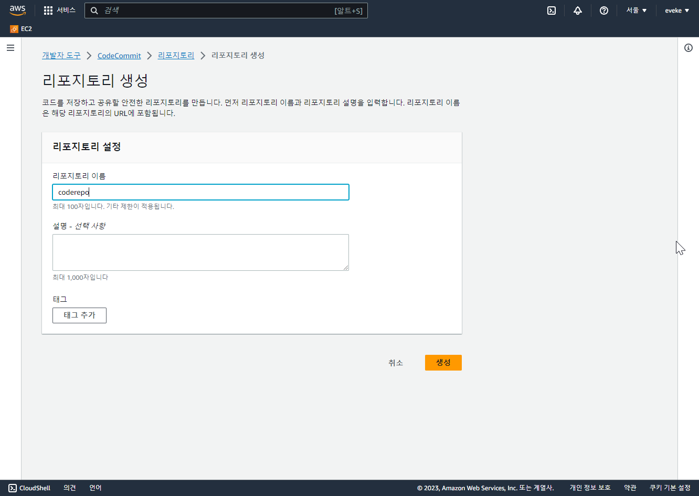
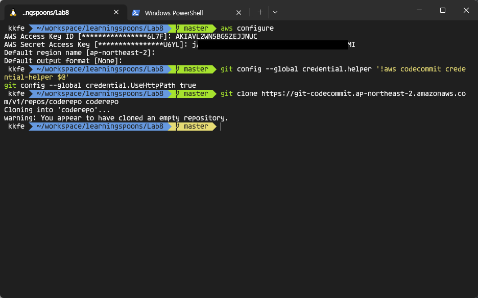
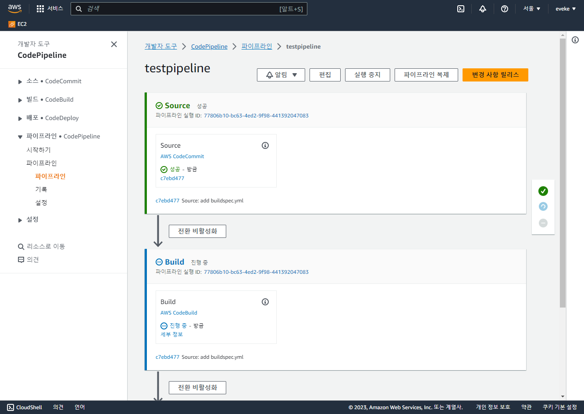

# AWS Code 시리즈 이용해보기

**사전준비사항**

- AWS 계정
- EC2 인스턴스
- git cli


## 1. Code Commit

AWS 콘솔 상단 검색바에서 codecommit을 검색하여 이동합니다.


CodeCommit 페이지에서 '리포지토리 생성'을 선택합니다.


이름을 지정하여 생성합니다.




IAM 서비스를 검색하여 이동합니다.


왼쪽 패널에서 사용자를 선택한 뒤, 사용자 추가를 합니다.


사용자 이름을 지정하고 다음으로 넘어 갑니다.


`직접 정책 연결``을 선택하고 [권한 정책] 검색 바에서 codecommit을 검색한 뒤, `AWSCodeCommitPowerUser`를 체크하고 다음으로 넘어가 사용자를 생성합니다.


생성한 사용자를 선택한 뒤, '보안 자격 증명' 탭을 선택합니다.


액세스 키 부분으로 내려가서 `액세스 키 만들기`를 선택합니다.


CLI를 체크한 뒤 하단의 권장 사항에 대한 안내 문구를 확인 한 뒤 다음으로 넘어 갑니다.


액세스키 정보를 따로 저장한 다음 완료 합니다.


cmd창에서 `aws configure`를 입력하여 생성한 액세스 키 정보를 입력합니다.
아래 git config 커맨드를 입력합니다. 

```
aws configure

git config --global credential.helper '!aws codecommit credential-helper $@'
git config --global credential.UseHttpPath true
```

콘솔에서 생성한 리포지토리의 HTTPS url 을 복사하여 clone 명령을 수행합니다.


```
git clone https://git-codecommit.ap-northeast-2.amazonaws.com/v1/repos/coderepo coderepo
```





테스트를 위해 test.txt를 생성하여 git add를 합니다.


commit을 완료한 뒤, 리포지토리에 push합니다.


콘솔에서 파일이 업로드 된 것을 확인할 수 있습니다.


## 2. Code Build

AWS 콘솔 상단 검색 바에서 Code Build를 검색해서 새 프로젝틀르 생성합니다.


프로젝트 이름을 지정합니다.


소스 공급자를 `AWS CodeCommit`으로 선택하고 생성한 리포지토리를 선택합니다.


아래와 같이 환경 설정을 진행 하고 생성을 완료 합니다.


## 3.  Code Deploy 설정

Code Deploy서비스 화면으로 넘어가서 새 어플리케이션을 생성 합니다.


어플리케이션 이름을 지정하고 생성합니다.


배포를 위한 Role을 만들기 위해 IAM 서비스 화면으로 넘어가서 왼쪽 패널의 역할을 선택한 뒤, 역할 만들기를 선택합니다.


AWS 서비스를 선택한 뒤, CodeDeploy를 선택합니다.


권한 정책을 확인한 다음 다음으로 넘어 갑니다.


역할 이름을 지정하고 생성을 완료 합니다.


Code Deploy 어플리케이션에서 배포그룹을 생성합니다.


그룹 이름을 지정하고 생성한 role이름을 선택합니다.


기존에 가지고 있는 EC2 인스턴스를 배포 대상으로 지정하도록 태그 값을 입력 합니다.


배포 설정을 완료 한 뒤 생성합니다.


## 4. Code Pipeline 설정

Code Pipeline으로 넘어가서 파이프라인을 생성합니다.


새 역할을 생성하도록 허용한 다음 다음으로 넘어 갑니다.


파이프라인의 소스 코드가 저장 되어 있는 리포지토리로 CodeCommit을 선택합니다.


생성한 Code Build 프로젝트를 선택합니다.


생성한 Code Deploy를 선택하고 다음으로 넘어 갑니다.


파이프 라인 생성 완료 후 설정한 stage별로 진행 상황을 확인할 수 있습니다.



