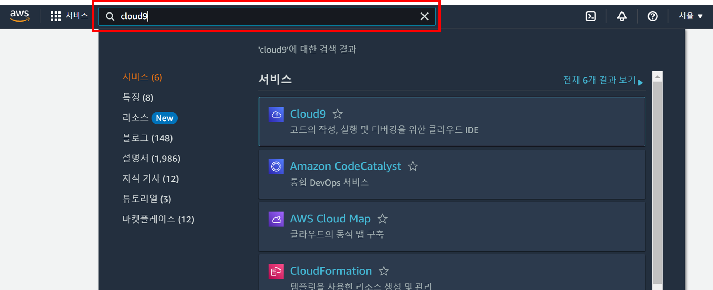

# Lab1: AWS에 웹 애플리케이션 배포하기

## 사전 준비 사항

- AWS 계정

### 실습 내용

- Cloud9 설정하기
- EC2 인스턴스 배포하기
- 인스턴스에 샘플 애플리케이션 배포하기
- 배포 테스트

## 실습 내용

### Cloud9 설정하기

AWS Cloud9은 브라우저만으로 코드를 작성, 실행 및 디버깅할 수 있는 클라우드 기반 IDE(통합 개발 환경)입니다. 코드 편집기, 디버거 및 터미널이 포함되어 있습니다. Cloud9은 JavaScript, Python, PHP를 비롯하여 널리 사용되는 프로그래밍 언어를 위한 필수 도구가 사전에 패키징되어 제공되므로, 새로운 프로젝트를 시작하기 위해 파일을 설치하거나 개발 머신을 구성할 필요가 없습니다. Cloud9 IDE는 클라우드 기반이므로, 인터넷이 연결된 머신을 사용하여 사무실, 집 또는 어디서든 프로젝트 작업을 할 수 있습니다.

1. AWS 콘솔([https://aws.amazon.com/ko/console/](https://aws.amazon.com/ko/console/))에 접속합니다.
2. 왼쪽 상단 검색창에서 Cloud9을 입력하여 `Cloud9 대시보드`로 이동합니다.
    
    
    
3. `Create environment` 버튼을 클릭합니다.
4. 아래와 같이 설정 후 `Create` 버튼을 클릭합니다.
- Name : Lab-IDE
- Environment type : New EC2 instance
- Instance type : t2.micro
5. 환경이 생생되면 목록에서 해당 IDE의 Cloud IDE `Open` 을 클릭합니다.
    
    
    

### EC2 Instance 배포하기

1. 왼쪽 상단 검색창에서 EC2를 입력하여 EC2 대시보드로 이동합니다.
    
    
    
2. 왼쪽 메뉴에서 인스턴스를 클릭합니다.
3. 오른쪽 상단 인스턴스 시작 버튼을 클릭합니다.
    
    
    
4. 아래와 같이 설정을 구성합니다.
- 이름 : TodoInstance
- Amazon Machine Image(AMI) (프리 티어 사용 가능)
- 인스턴스 유형 : t2.micro
- 키 페어(로그인)
    - 새 키 페어 생성 클릭
    - 키 페어 이름 : TodoKeyPair
    - 키 페어 생성 버튼 클릭
- 네트워크 설정 아래와 같이 구성
    
    
    
5. 나머지 설정은 그대로 두고 `인스턴스 시작` 버튼을 클릭합니다.

### Instance에 Nginx 설치하기

**인스턴스 접속하기**

1. 생성된 인스턴스를 선택하고 퍼블릭 IPv4 주소를 확인합니다.
    
    
    
2. 아까 생성해 둔 `Cloud9 IDE 탭`으로 이동합니다. 
3. 생성해 둔 키 페어를 업로드합니다.
4. 메뉴에서 `File > Upload Local Files` 를 클릭하고 생성한 `TodoKeyPair.pem` 파일을 업로드 합니다.
    
    
    
5. `+ 버튼`을 클릭하여 터미널 탭을 켭니다.
    
    
    

6. 아래 명령어를 사용하여 키 페어의 권한을 변경합니다.

    ```bash
    chmod 400 TodoKeyPair.pem
    ```

7. 아래 명령어를 사용하여 TodoInstance에 접속합니다.

    ```bash
    ssh -i TodoKeyPair.pem <복사해 둔 Instance IP>
    ```

    

### 인스턴스에 샘플 애플리케이션 배포하기

8. 샘플 애플리케이션을 받기 위해 인스턴스에 Git을 설치합니다.

    ```bash
    sudo yum update -y
    sudo yum install git -y
    sudo yum install -y sudo
    ```

9. 아래 명령어를 사용하여 샘플 애플리케이션을 복제 받습니다.

    ```bash
    git clone https://github.com/learningspoons-VOD-infra/Engineer-For-IT-Infra-Structure-2023.git
    ```

10. 샘플 애플리케이션을 현재 경로로 이동합니다.

    ```bash
    mv Engineer-For-IT-Infra-Structure-2023/SampleApp/Lab1/TodoApp .
    ```

11. 프로젝트를 실행하기 위해 필요한 라이브러리를 설치하기 위해 pip를 설치합니다.

    ```bash
    curl -O https://bootstrap.pypa.io/get-pip.py
    python3 get-pip.py --user
    ```

12. TodoApp 폴더로 이동합니다.

    ```bash
    cd TodoApp
    ```

13. 프로젝트를 실행하기 위해 필요한 라이브러리를 설치합니다.

    ```bash
    pip install -r requirements.txt
    ```

14. 샘플 애플리케이션을 실행합니다.

    ```bash
    uvicorn main:app --host 0.0.0.0 --port 8000 > app.log 2>&1 &
    ```

### 배포 테스트

**시큐리티 그룹 설정**

1. EC2 대시보드에서 생성한 `TodoInstance`를 클릭하고 하단의 보안 탭을 클릭합니다.
2. `보안 그룹`을 클릭합니다.
    
    
    

3. `인바운드 규칙 편집` 버튼을 클릭하고 아래와 같이 구성 후, `규칙 저장` 버튼을 클릭합니다.
    
    
    

**애플리케이션 테스트**

1. 새 탭을 열고 앞서 복사해둔 `인스턴스의 IP:8000` 를 입력합니다.
2. 다음과 같이 뜨면 애플리케이션이 정상 배포된 것을 확인할 수 있습니다.
    
    